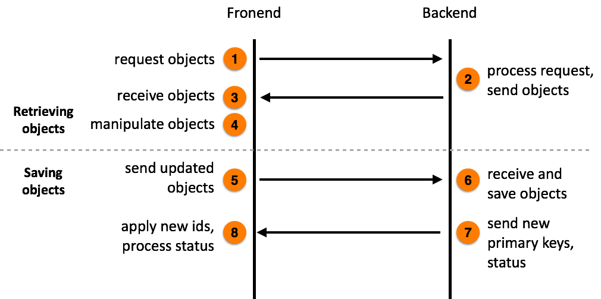
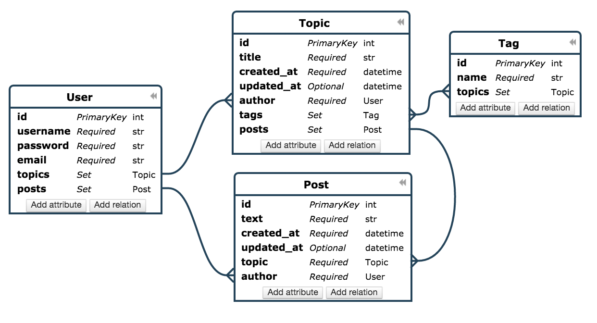
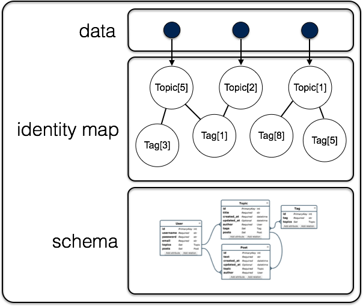

PonyJS - using Pony ORM objects at the frontend
===============================================

Introduction
------------

Pony simplifies writing business logic at the backend. But what if you need to work with the same objects at the frontend? This is where PonyJS comes in to play.

PonyJS allows getting backend objects with all related objects to the frontend, traverse relationships, create or modify objects, send updated objects to the backend in order to save them in the database.

Using the same objects at the backend and frontend simplifies building Single Page Applications (SPA).

The PonyJS workflow consists of several steps:

If you don't need to create or modify objects at the frontend, the first 4 steps is all that you need. These 4 steps can be repeated as many times as you need.

Steps from 5 to 8 are needed only if you want to save objects created or modified at the frontend in the database.

Now let’s look into the process in the detail.

Forum data model
----------------

We are going to illustrate PonyJS workflow using a simple Forum data model example. Here is Forum Entity-Relationship diagram:

The diagram can be viewed in the |online_editor|.

.. |online_editor| raw:: html

    <a href="https://editor.ponyorm.com/user/pony/Forum" target="_blank">Online Entity-Relationship Diagram Editor</a>

Here is the entities declaration:

.. code-block:: python

   from datetime import datetime
   from pony.orm import *

   db = Database("sqlite", "database.sqlite", create_db=True)

   class User(db.Entity):
       id = PrimaryKey(int, auto=True)
       username = Required(str)
       password = Required(str)
       email = Required(str)
       topics = Set("Topic")
       posts = Set("Post")

   class Topic(db.Entity):
       id = PrimaryKey(int, auto=True)
       title = Required(str)
       created_at = Required(datetime, default=datetime.now)
       updated_at = Optional(datetime)
       author = Required(User)
       tags = Set("Tag")
       posts = Set("Post")

   class Post(db.Entity):
       id = PrimaryKey(int, auto=True)
       text = Required(str)
       created_at = Required(datetime, default=datetime.now)
       updated_at = Optional(datetime)
       topic = Required(Topic)
       author = Required(User)

   class Tag(db.Entity):
       id = PrimaryKey(int, auto=True)
       name = Required(str, unique=True)
       topics = Set(Topic)

   sql_debug(True)
   db.generate_mapping(create_tables=True)

In this schema we have a ``User`` entity with required ``username``, ``password``, ``email`` attributes. The attributes ``User.topics`` and ``User.posts`` are declared as ``Set``. This is how we declare a to-many relationship in Pony. Each ``Topic`` and ``Post`` instances belong to a ``User`` object via the required ``author`` attribute.

A user can create a topic and then, any user can post to this topic. The ``Topic`` entity has one-to-many relationship to ``Post`` - each topic can have many posts related to it. The attributes ``Topic.title`` and ``Post.text`` are self explanatory.

Also, there is a many-to-many relationship between the ``Topic`` and ``Tag`` entities. Each topic can be associated with any number of tags. And each tag can be assigned to any number of topics.

Both ``Topic`` and ``Post`` entities have ``created_at`` and ``updated_at`` attributes which keep the timestamp of when the object was created or updated. The ``Tag.name`` attribute is declared as unique, in order to prevent creating tag duplicates.

Step 1. Requesting objects from the backend
-------------------------------------------

Typically, a Single Page Application requests data from the backend using asynchronous Ajax calls. Pony provides the ``pony.load()`` function for making such calls. Here is an example:

.. code-block:: javascript
   :linenos:

   pony.load('/get-topics', {
        data: {limit: 3},
        success: function (topics) {
            // process received objects
        }
    });

Here we are going to get 3 ``Topic`` objects from the backend.

1. The first parameter is the URL to which our request is sent.
2. ``data`` - contains parameters which will be sent to the backend along with the request. Here you can put anything you want - all this data will be passed to the backend as GET parameters.
3. ``success`` - the function which will be called once the response from the backend is received.

This function receives JavaScript representation of Pony backend objects.

Pony uses the |jquery_ajax| function for making Ajax calls. You can find more information about it in PonyJS reference.

Step 2. Sending objects to the frontend
---------------------------------------

First of all our backend needs to have a handler which processes HTTP requests. In our example we use Flask framework. Here is our handler:

.. code-block:: python
   :linenos:

   @app.route('/get-topics')
   @db_session
   def get_topics():
       limit = request.args.get('limit', 3)
       topics = Topic.select().order_by(desc(Topic.updated_at))[:limit]
       return topics.to_json()

Comments to the code:

1. ``@app.route()`` - Flask decorator which tells what URL should trigger our handler.
2. ``@db_session()`` - Pony decorator, it wraps the code which works with the database.
3. Handler function definition.
4. Extracting GET parameter passed from the frontend. The default value is 3, if no ``limit`` parameter is specified.
5. In this query we order topics by the ``Topic.updated_at`` attribute in the descending order, and select only the specified number of topics from the beginning. This way we get three most recently updated topics.
6. Convert the query result into JSON packet which will be sent to the frontend. This JSON packet has all the necessary information for recreating objects at the frontend.

Now, let's say we want to transfer not only topics, but also tags, related to these topics. For this purpose we use the ``include`` keyword:

.. code-block:: python
   :emphasize-lines: 6

   @app.route('/get-topics')
   @db_session
   def get_topics():
       limit = request.args.get('limit', 3)
       topics = Topic.select().order_by(desc(Topic.updated_at))[:limit]
       return topics.to_json(include=[Topic.tags])

The ``include`` parameter receives a list of attributes which should be included into the JSON packet. In our example we include all tags related to each selected topic.

Now the JSON packet contains 3 most recently update topics and related tags. Let's look into the structure of the JSON packet now:

In our example the JSON packet consists of 4 parts:

1. User data - the list of three topics.
2. The identity map of objects - topics and related tags.
3. The schema of entities.
4. The schema md5 hash.

User data contains references to objects which are stored in the identity map. The identity map contains a single copy for each object. In our example, even if a tag is assigned to several topics, we won't have many copies of the ``Tag`` object. All that topics will reference to a single tag object stored in the identity map.

The schema is needed for reconstructing objects and its relationships at the frontend. Also, the schema is used when we create new instances of objects at the frontend.

The schema hash is used for saving bandwidth. The hash will be sent to the backend with the next ``pony.load()`` call. If the schema is not changed at the backend, the backend won't sent it again.

Step 3. Receiving backend objects at the frontend
-------------------------------------------------

When JSON packet is received at the frontend, Pony processes it and splits into several parts:

- ``pony.objects`` - the Identity Map which keeps objects sent from backend.
- ``pony.entities`` - JavaScript representation of database schema.

Besides this, the result of the query which was sent from the backend, will be passed to the ``success`` function:

.. code-block:: javascript
   :linenos:
   :emphasize-lines: 3

   pony.load('/get-topics', {
        data: {limit: 3},
        success: function (topics) {
            // process received objects
        }
    });

In our example we will get a list of topics with attached tags.

If your program receives data from the backend more than once, the Identity Map represented by ``pony.objects`` variable will be updated with the new objects received from the backend.

Step 4. Working with objects at the frontend
--------------------------------------------

With PonyJS you can create, modify, delete objects at the frontend and then save them in the database.

Access object attributes
~~~~~~~~~~~~~~~~~~~~~~~~

For representing object attributes PonyJS uses the `KnockoutJS implementation of observables <http://knockoutjs.com/documentation/observables.html>`_. Observables allow subscribing to changes and can be used for two-way binding with HTML elements. When attributes in the model get updated, so does the HTML element. When HTML elements get updated, the changes get propagated back to the model.

But Pony does not require you to use two-way binging in your application, it is up to you.

In order to read an attribute value you need to call an attribute as a function with no parameters:

.. code-block:: javascript

    var t1 = topics[0];
    var title = t1.title();

In the example above we read the value of the attribute ``title``.

Update object
~~~~~~~~~~~~~

For assigning a new value to an attribute, you need to call it and pass the new value as a parameter. Here we assign a new value to the ``title`` attribute of the ``Topic`` object:

.. code-block:: javascript

    var t1 = topics[0];
    t1.title('New title');

Pony accumulates all changes made at the frontend and sends them in one batch to the backend. Will talk about it later in this chapter.

Create new object
~~~~~~~~~~~~~~~~~

The ``pony.entities`` object keeps the entity definitions. Properties of the ``pony.entities`` object are the entity names. Values are the meta entity objects. In order to create a new object you need to call the method ``create`` of such a meta entity object. Let's create a new ``Tag`` object as an example:

.. code-block:: javascript

    var t = pony.entities.Tag.create()

The ``t`` variable now contains a newly created instance of the ``Tag`` entity. After the object is created, you can assign values to its attributes. At the backend you have to specify the ``Required`` attributes during creation of a new object. At the frontend you can create an object and assign the attribute values later - it can be convenient when you bind a new object attributes to an HTML form.

If you want, you can specify the attributes during creation of an object. Here is an example:

.. code-block:: javascript

    var t = pony.entities.Tag.create({name: 'New tag'})

Get an object by primary key
~~~~~~~~~~~~~~~~~~~~~~~~~~~~

In order to get an entity instance by its primary key, use the ``getByPk`` method of the meta entity object. This is an example of getting an ``Topic`` object by the primary key ``1``:

.. code-block:: javascript

    var topic = pony.entities.Topic.getByPk(1)

If the object with such primary key was not passed to the frontend, you'll get an exception. For example, if we'll try to get a ``Topic`` with the primary key equal to 0, we'll get the ``Topic with primary key 0 not found`` exception.

Delete object
~~~~~~~~~~~~~

For deleting an object, you need to call the method ``destroy()`` on an object:

.. code-block:: javascript

    var topic = pony.entities.Topic.getByPk(1)
    topic.destroy()

After the ``destroy()`` method is called, the object will be **marked as deleted**. The actual deletion will happen when you will send the updates to the backend.

Add object to a collection
~~~~~~~~~~~~~~~~~~~~~~~~~~

In Pony we call to-many relationship attribute a collection. In our Forum diagram we have several collection examples: ``User.topics``, ``Topic.tags``, etc. The collection attributes have the following methods: ``add()``, ``remove()`` and ``create()``. The method ``add()`` adds an object to a collection, or, in other words, establishes a new relationship between two objects:

.. code-block:: javascript

    var topic = pony.entities.Topic.getByPk(1)
    var tag = pony.entities.Tag.getByPk(1)
    topic.tags().add(tag)

In Pony all relationships are bidirectional. So, when you establish a new relationship, both ``topic.tags()`` and ``tag.topics()`` collections will be changed.

If a collection already has such an item, nothing will happen.

Remove object from a collection
~~~~~~~~~~~~~~~~~~~~~~~~~~~~~~~

The ``remove()`` function removes an item from a collection:

.. code-block:: javascript

    var topic = pony.entities.Topic.getByPk(1)
    var tag = pony.entities.Tag.getByPk(1)
    topic.tags().remove(tag)

If there is no such item in the collection, nothing will happen. The update will be saved and applied to the database, once you send the update to the backend.

Create an object and add it to a collection
~~~~~~~~~~~~~~~~~~~~~~~~~~~~~~~~~~~~~~~~~~~

When you need to create an object and add it to a collection at once, you can use the ``create()`` method of a relationship attribute:

.. code-block:: javascript

    var topic = pony.entities.Topic.getByPk(1)
    var tag = topic.tags.create({name: 'New tag'})

In the example above, a new tag will be created and a relation between the new ``Tag`` and ``Topic`` objects will be established. If you check the ``topics`` attribute of the newly created tag, you will see that it has the ``Topic[1]`` objects associated with it.

cacheModified
~~~~~~~~~~~~~

The ``pony.cacheModified()`` observable is a boolean variable that indicates if objects where changed after they were received from the backend. You can subscribe to the ``cacheModified`` changes using the Knockout ``subscribe()`` method:

.. code-block:: javascript

    pony.cacheModified.subscribe(function() {
        alert('Something was changed');
    });

Step 5. Sending updated objects to the backend
----------------------------------------------

The function ``pony.save()`` is used for sending updated objects to the backend:

.. code-block:: javascript

    pony.save('/update', {
        success: function () {
            // do something - notify user, etc.
        },
        error: function() {
            // process error
        }
     })

This function sends all changed Pony objects using the HTTP POST method. Besides the objects which Pony sends automatically, you can pass any arbitrary data with this request.

Step 6 and 7. Receiving and saving updated objects at the backend. Sending new primary keys to the frontend
-----------------------------------------------------------------------------------------------------------

Now let's see how we receive the updates at the backend. Below is the Flask example:

.. code-block:: python
   :linenos:

    @app.route('/update', methods=['POST'])
    @db_session
    def update():
        changes = request.form['changes']
        db.from_json(changes)
        return db.to_json()

1. Assign the '/update' URL and accept only POST requests.
2. ``@db_session`` wraps the handler into a database transaction.
3. Define the handler function.
4. ``request.form`` is a dict provided by Flask which we use for extracting data from POST request. Pony uses 'changes' as a key for sending the information about updates.
5. Apply changes to the database using the ``db.from_json()`` method.
6. Send the results to frontend. When we call ``db.to_json()`` in the same ``db_session``, Pony inserts the results of ``db.from_json()`` in the resulting JSON packet. If new objects were inserted into the database, this packet will contain primary keys of newly created objects. Once this JSON packet reaches frontend, PonyJS assigns this primary keys to objects at the frontend.

Step 8. Applying new ids, processing status
-------------------------------------------

Let's get back to the code we saw at the step 5:

.. code-block:: javascript

    pony.save('/update', {
        success: function () {
            // do something - notify user, etc.
        },
        error: function() {
            // process error
        }
     })

If update at the backend was successful, the ``success`` function will be called. If new objects were inserted or deleted Pony will update the Identity Map with the newly created primary keys, or delete objects from the frontend.

If the database update fails at the backend, the ``error`` function will be called. The function can receive a number of arguments, which are described in |jquery_ajax| documentation.

.. |jquery_ajax| raw:: html

    <a href="http://api.jquery.com/jquery.ajax/#jQuery-ajax-settings" target="_blank">jQuery.ajax()</a>

