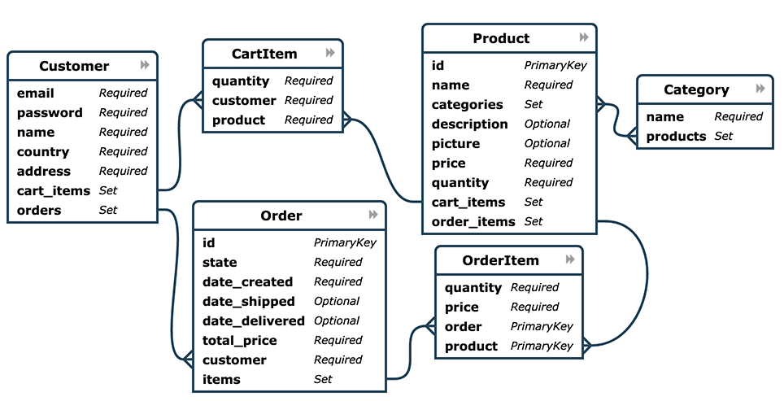

Queries
=======

Pony provides a very convenient way to query the database using the generator expression syntax. Pony allows programmers to work with objects which are stored in a database as if they were stored in memory, using native Python syntax. It makes development much easier.

For writing queries you can use Python generator expressions or lambdas.

Using Python generator expressions
----------------------------------

A Python generator syntax is a very natural way of writing queries. Here is an example of a generator expression:

.. code-block:: python

    (expression for x in s if condition)

The meaning of this generator expression is the following:

.. code-block:: python

    for x in s:
        if condition:
            yield expression

Pony provides a number of functions, for example :py:func:`select`, that receive a generator expression, and then translate this generator into a SQL query. The process of the translation is described in this `StackOverflow question <http://stackoverflow.com/questions/16115713/how-pony-orm-does-its-tricks>`_.

Here is an example of a query:

.. code-block:: python

    select(c for c in Customer if sum(c.orders.total_price) > 1000)

This query returns an instance of a :py:class:`Query` class, and you can then call the :py:class:`Query` object methods for getting the result, for example:

.. code-block:: python

    select(c for c in Customer if sum(c.orders.total_price) > 1000).first()

Besides the list of entities, you can return either a list of attributes:

.. code-block:: python

    select(c.name for c in Customer if sum(c.orders.total_price) > 1000)

Or a list of tuples:

.. code-block:: python

    select((c, sum(c.orders.total_price)) for c in Customer
                                          if sum(c.orders.total_price) > 1000)

Using lambda functions
----------------------

Instead of using a generator, you can write queries using the lambda function:

.. code-block:: python

    Customer.select(lambda: sum(c.orders.price) > 1000)

From the point of the translation the query into SQL there is no difference, if you use a generator or a lambda. The only difference is that using the lambda you can only return entity instances - there is no way to return a list of specific entity attributes or a list of tuples.

Pony ORM functions used to query the database
---------------------------------------------

See the :ref:`Queries and functions <queries_and_functions>` part of the API Reference for details.

Pony query examples
-------------------

For demonstrating Pony queries let's use the example from the Pony ORM distribution. You can try these queries yourself in the interactive mode and see the generated SQL. For this purpose import the example module this way:

.. code-block:: python

    >>> from pony.orm.examples.estore import *

This module offers a simplified data model of a eCommerce online store. Here is the `ER Diagram of the data model`_:

.. _ER Diagram of the data model: https://editor.ponyorm.com/user/pony/eStore

Here are the entity definitions:

.. code-block:: python

    from decimal import Decimal
    from datetime import datetime

    from pony.converting import str2datetime
    from pony.orm import *

    db = Database()

    class Customer(db.Entity):
        email = Required(str, unique=True)
        password = Required(str)
        name = Required(str)
        country = Required(str)
        address = Required(str)
        cart_items = Set('CartItem')
        orders = Set('Order')

    class Product(db.Entity):
        id = PrimaryKey(int, auto=True)
        name = Required(str)
        categories = Set('Category')
        description = Optional(str)
        picture = Optional(buffer)
        price = Required(Decimal)
        quantity = Required(int)
        cart_items = Set('CartItem')
        order_items = Set('OrderItem')

    class CartItem(db.Entity):
        quantity = Required(int)
        customer = Required(Customer)
        product = Required(Product)

    class OrderItem(db.Entity):
        quantity = Required(int)
        price = Required(Decimal)
        order = Required('Order')
        product = Required(Product)
        PrimaryKey(order, product)

    class Order(db.Entity):
        id = PrimaryKey(int, auto=True)
        state = Required(str)
        date_created = Required(datetime)
        date_shipped = Optional(datetime)
        date_delivered = Optional(datetime)
        total_price = Required(Decimal)
        customer = Required(Customer)
        items = Set(OrderItem)

    class Category(db.Entity):
        name = Required(str, unique=True)
        products = Set(Product)

    sql_debug(True)
    db.bind('sqlite', 'estore.sqlite', create_db=True)
    db.generate_mapping(create_tables=True)

When you import this example, it will create the SQLite database in the file 'estore.sqlite' and fill it with some test data. Below you can see some query examples:

.. code-block:: python

    # All USA customers
    Customer.select(lambda c: c.country == 'USA')

    # The number of customers for each country
    select((c.country, count(c)) for c in Customer)

    # Max product price
    max(p.price for p in Product)

    # Max SSD price
    max(p.price for p in Product
                for cat in p.categories if cat.name == 'Solid State Drives')

    # Three most expensive products
    Product.select().order_by(desc(Product.price))[:3]

    # Out of stock products
    Product.select(lambda p: p.quantity == 0)

    # Most popular product
    Product.select().order_by(lambda p: desc(sum(p.order_items.quantity))).first()

    # Products that have never been ordered
    Product.select(lambda p: not p.order_items)

    # Customers who made several orders
    Customer.select(lambda c: count(c.orders) > 1)

    # Three most valuable customers
    Customer.select().order_by(lambda c: desc(sum(c.orders.total_price)))[:3]

    # Customers whose orders were shipped
    Customer.select(lambda c: SHIPPED in c.orders.state)

    # Customers with no orders
    Customer.select(lambda c: not c.orders)

    # The same query with the LEFT JOIN instead of NOT EXISTS
    left_join(c for c in Customer for o in c.orders if o is None)

    # Customers which ordered several different tablets
    select(c for c in Customer
             for p in c.orders.items.product
             if 'Tablets' in p.categories.name and count(p) > 1)

You can find more queries in the `pony.orm.examples.estore`_ module.

.. _pony.orm.examples.estore: https://github.com/ponyorm/pony/blob/orm/pony/orm/examples/estore.py

Query object methods
--------------------

See the :ref:`Query result <query_result>` part of the API Reference for details.

.. _automatic_distinct:

Automatic DISTINCT
------------------

Pony tries to avoid duplicates in a query result by automatically adding the ``DISTINCT`` SQL keyword where it is necessary, because useful queries with duplicates are very rare. When someone wants to retrieve objects with a specific criteria, they typically don't expect that the same object will be returned more than once. Also, avoiding duplicates makes the query result more predictable: you don't need to filter duplicates out of a query result.

Pony adds the ``DISCTINCT`` keyword only when there could be potential duplicates. Let's consider a couple of examples.

1) Retrieving objects with a criteria:

.. code-block:: python

    Person.select(lambda p: p.age > 20 and p.name == 'John')

In this example, the query doesn't return duplicates, because the result contains the primary key column of a Person. Since duplicates are not possible here, there is no need in the ``DISTINCT`` keyword, and Pony doesn't add it:

.. code-block:: sql

    SELECT "p"."id", "p"."name", "p"."age"
    FROM "Person" "p"
    WHERE "p"."age" > 20
      AND "p"."name" = 'John'

2) Retrieving object attributes:

.. code-block:: python

    select(p.name for p in Person)

The result of this query returns not objects, but its attribute. This query result can contain duplicates, so Pony will add DISTINCT to this query:

.. code-block:: sql

    SELECT DISTINCT "p"."name"
    FROM "Person" "p"

The result of a such query typically used for a dropdown list, where duplicates are not expected. It is not easy to come up with a real use-case when you want to have duplicates here.

If you need to count persons with the same name, you'd better use an aggregate query:

.. code-block:: python

    select((p.name, count(p)) for p in Person)

But if it is absolutely necessary to get all person's names, including duplicates, you can do so by using the :py:meth:`Query.without_distinct()` method:

.. code-block:: python

    select(p.name for p in Person).without_distinct()

3) Retrieving objects using joins:

.. code-block:: python

    select(p for p in Person for c in p.cars if c.make in ("Toyota", "Honda"))

This query can contain duplicates, so Pony eliminates them using ``DISTINCT``:

.. code-block:: sql

    SELECT DISTINCT "p"."id", "p"."name", "p"."age"
    FROM "Person" "p", "Car" "c"
    WHERE "c"."make" IN ('Toyota', 'Honda')
      AND "p"."id" = "c"."owner"

Without using DISTINCT the duplicates are possible, because the query uses two tables (Person and Car), but only one table is used in the SELECT section. The query above returns only persons (and not their cars), and therefore it is typically not desirable to get the same person in the result more than once. We believe that without duplicates the result looks more intuitive.

But if for some reason you don't need to exclude duplicates, you always can add :py:meth:`~Query.without_distinct()` to the query:

.. code-block:: python

    select(p for p in Person for c in p.cars
             if c.make in ("Toyota", "Honda")).without_distinct()

The user probably would like to see the Person objects duplicates if the query result contains cars owned by each person. In this case the Pony query would be different:

.. code-block:: python

    select((p, c) for p in Person for c in p.cars if c.make in ("Toyota", "Honda"))

And in this case Pony will not add the ``DISTINCT`` keyword to SQL query.

To summarize:

1. The principle "all queries do not return duplicates by default" is easy to understand and doesn't lead to surprises.
2. Such behavior is what most users want in most cases.
3. Pony doesn't add DISTINCT when a query is not supposed to have duplicates.
4. The query method :py:meth:`~Query.without_distinct()` can be used for forcing Pony do not eliminate duplicates.

Functions which can be used inside a query
------------------------------------------

Here is the list of functions that can be used inside a generator query:

* :py:func:`avg`
* :py:func:`abs`
* :py:func:`exists`
* :py:func:`len`
* :py:func:`max`
* :py:func:`min`
* :py:func:`count`
* :py:func:`concat`
* :py:func:`random`
* :py:func:`raw_sql`
* :py:func:`select`
* :py:func:`sum`
* :py:func:`getattr`

Examples:

.. code-block:: python

    select(avg(c.orders.total_price) for c in Customer)

.. code-block:: sql

    SELECT AVG("order-1"."total_price")
    FROM "Customer" "c"
      LEFT JOIN "Order" "order-1"
        ON "c"."id" = "order-1"."customer"

.. code-block:: python

    select(o for o in Order if o.customer in
           select(c for c in Customer if c.name.startswith('A')))[:]

.. code-block:: sql

    SELECT "o"."id", "o"."state", "o"."date_created", "o"."date_shipped",
           "o"."date_delivered", "o"."total_price", "o"."customer"
    FROM "Order" "o"
    WHERE "o"."customer" IN (
        SELECT "c"."id"
        FROM "Customer" "c"
        WHERE "c"."name" LIKE 'A%'
        )

Using getattr()
~~~~~~~~~~~~~~~

`getattr() <https://docs.python.org/3/library/functions.html#getattr>`_ is a built-in Python function, that can be used for getting the attribute value.

Example:

.. code-block:: python

    attr_name = 'name'
    param_value = 'John'
    select(c for c in Customer if getattr(c, attr_name) == param_value)

.. _using_raw_sql_ref:

Using raw SQL
-------------

Pony allows using raw SQL in your queries. There are two options on how you can use raw SQL:

1. Use the :py:func:`raw_sql` function in order to write only a part of a generator or lambda query using raw SQL.
2. Write a complete SQL query using the :py:meth:`Entity.select_by_sql` or :py:meth:`Entity.get_by_sql` methods.

Using the raw_sql() function
~~~~~~~~~~~~~~~~~~~~~~~~~~~~

Let's explore examples of using the :py:func:`raw_sql` function. Here is the schema and initial data that we'll use for our examples:

.. code-block:: python

    from datetime import date
    from pony.orm import *

    db = Database('sqlite', ':memory:')

    class Person(db.Entity):
        id = PrimaryKey(int)
        name = Required(str)
        age = Required(int)
        dob = Required(date)

    db.generate_mapping(create_tables=True)

    with db_session:
        Person(id=1, name='John', age=30, dob=date(1986, 1, 1))
        Person(id=2, name='Mike', age=32, dob=date(1984, 5, 20))
        Person(id=3, name='Mary', age=20, dob=date(1996, 2, 15))

The :py:func:`raw_sql` result can be treated as a logical expression:

.. code-block:: python

    select(p for p in Person if raw_sql('abs("p"."age") > 25'))

The :py:func:`raw_sql` result can be used for a comparison:

.. code-block:: python

    q = Person.select(lambda x: raw_sql('abs("x"."age")') > 25)
    print(q.get_sql())

    SELECT "x"."id", "x"."name", "x"."age", "x"."dob"
    FROM "Person" "x"
    WHERE abs("x"."age") > 25

Also, in the example above we use ``raw_sql()`` in a lambda query and print out the resulting SQL. As you can see the raw SQL part becomes a part of the whole query.

The :py:func:`raw_sql` can accept $parameters:

.. code-block:: python

    x = 25
    select(p for p in Person if raw_sql('abs("p"."age") > $x'))

You can change the content of the :py:func:`raw_sql` function dynamically and still use parameters inside:

.. code-block:: python

    x = 1
    s = 'p.id > $x'
    select(p for p in Person if raw_sql(s))

Another way of using dynamic raw SQL content:

.. code-block:: python

    x = 1
    cond = raw_sql('p.id > $x')
    select(p for p in Person if cond)

You can use various types inside the raw SQL query:

.. code-block:: python

    x = date(1990, 1, 1)
    select(p for p in Person if raw_sql('p.dob < $x'))

Parameters inside the raw SQL part can be combined:

.. code-block:: python

    x = 10
    y = 15
    select(p for p in Person if raw_sql('p.age > $(x + y)'))

You can even call Python functions inside:

.. code-block:: python

    select(p for p in Person if raw_sql('p.dob < $date.today()'))

The :py:func:`raw_sql` function can be used not only in the condition part, but also in the part which returns the result of the query:

.. code-block:: python

    names = select(raw_sql('UPPER(p.name)') for p in Person)[:]
    print(names)

    ['JOHN', 'MIKE', 'MARY']

But when you return data using the :py:func:`raw_sql` function, you might need to specify the type of the result, because Pony has no idea on what the result type is:

.. code-block:: python

    dates = select(raw_sql('(p.dob)') for p in Person)[:]
    print(dates)

    ['1985-01-01', '1983-05-20', '1995-02-15']

If you want to get the result as a list of dates, you need to specify the ``result_type``:

.. code-block:: python

    dates = select(raw_sql('(p.dob)', result_type=date) for p in Person)[:]
    print(dates)

    [datetime.date(1986, 1, 1), datetime.date(1984, 5, 20), datetime.date(1996, 2, 15)]

The :py:func:`raw_sql` function can be used in a :py:meth:`Query.filter` too:

.. code-block:: python

    x = 25
    select(p for p in Person).filter(lambda p: p.age > raw_sql('$x'))

It can be used inside the :py:meth:`Query.filter` without lambda. In this case you have to use the first letter of entity name in lower case as the alias:

.. code-block:: python

    x = 25
    Person.select().filter(raw_sql('p.age > $x'))

You can use several :py:func:`raw_sql` expressions in a single query:

.. code-block:: python

    x = '123'
    y = 'John'
    Person.select(lambda p: raw_sql("UPPER(p.name) || $x")
                            == raw_sql("UPPER($y || '123')"))

The same parameter names can be used several times with different types and values:

.. code-block:: python

    x = 10
    y = 31
    q = select(p for p in Person if p.age > x and p.age < raw_sql('$y'))
    x = date(1980, 1, 1)
    y = 'j'
    q = q.filter(lambda p: p.dob > x and p.name.startswith(raw_sql('UPPER($y)')))
    persons = q[:]

You can use :py:func:`raw_sql` in :py:meth:`Query.order_by` section:

.. code-block:: python

    x = 9
    Person.select().order_by(lambda p: raw_sql('SUBSTR(p.dob, $x)'))

Or without lambda, if you use the same alias, that you used in previous filters. In this case we use the default alias - the first letter of the entity name:

.. code-block:: python

    x = 9
    Person.select().order_by(raw_sql('SUBSTR(p.dob, $x)'))

.. _entities_raw_sql_ref:

Using the select_by_sql() and get_by_sql() methods
~~~~~~~~~~~~~~~~~~~~~~~~~~~~~~~~~~~~~~~~~~~~~~~~~~

Although Pony can translate almost any condition written in Python to SQL, sometimes the need arises to use raw SQL, for example - in order to call a stored procedure or to use a dialect feature of a specific database system. In this case, Pony allows the user to write a query in a raw SQL, by placing it inside the function :py:meth:`Entity.select_by_sql` or :py:meth:`Entity.get_by_sql` as a string:

.. code-block:: python

    Product.select_by_sql("SELECT * FROM Products")

Unlike the method :py:meth:`Entity.select`, the method :py:meth:`Entity.select_by_sql` does not return the :py:class:`Query` object, but a list of entity instances.

Parameters are passed using the following syntax: "$name_variable" or "$(expression in Python)". For example:

.. code-block:: python

    x = 1000
    y = 500
    Product.select_by_sql("SELECT * FROM Product WHERE price > $x OR price = $(y * 2)")

When Pony encounters a parameter within a raw SQL query, it gets the variable value from the current frame (from globals and locals) or from the dictionaries which can be passed as parameters:

.. code-block:: python

    Product.select_by_sql("SELECT * FROM Product WHERE price > $x OR price = $(y * 2)",
                           globals={'x': 100}, locals={'y': 200})

Variables and more complex expressions specified after the ``$`` sign, will be automatically calculated and transferred into the query as parameters, which makes SQL-injection impossible. Pony automatically replaces $x in the query string with "?", "%S" or with other paramstyle, used in your database.

If you need to use the ``$`` sign in the query (for example, in the name of a system table), you have to write two ``$`` signs in succession: ``$$``.
